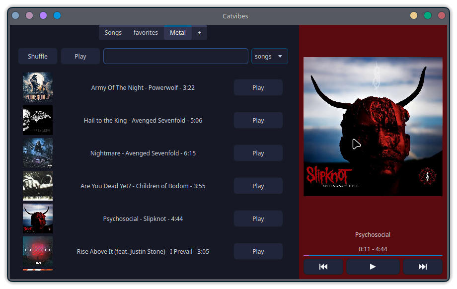
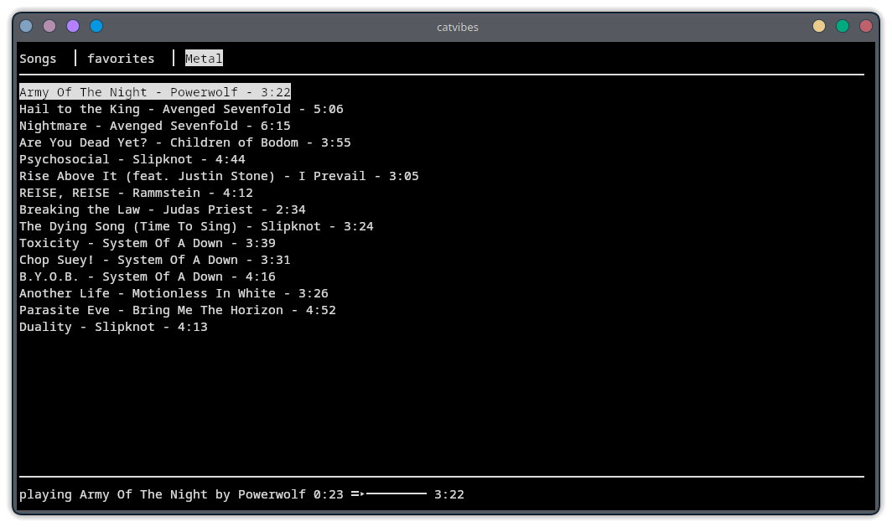

# Catvibes
A simple music player offering not only a terminal based frontend but also a Qt based one.

# Qt look (with kvantum theme)

# Qt look (with Windows theme)

# terminal look

# Instalation

## Requirements:
python and the following packages:

    pip install ytmusicapi eyed3 yt-dlp PyQt6

it also requires ffplay

On linux install ffmpeg on debian-based and arch-based distros available and probably already installed

On Windows use the following link: https://www.ffmpeg.org/download.html#build-windows, select windows and chose one of the available .exe files

# Controlls
## GUI:
launch with the --gui flag

## commandline:
f: find a song by typing a searchterm (ideally songname and bandname). Shows 3 results by default (select with the number keys).

esc: terminates searching usw and also exits the programm

r: random shuffle, shuffles the queue randomly and adds the whole playlist to the queue when empty

p/enter: play the whole playlist

a: add current song to the playlist

space: play / pause

n: next song

b: previous song

l: create a new playlist